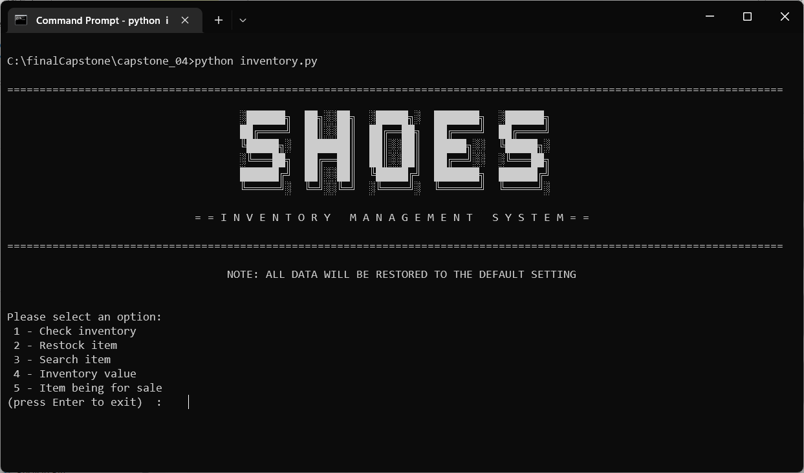
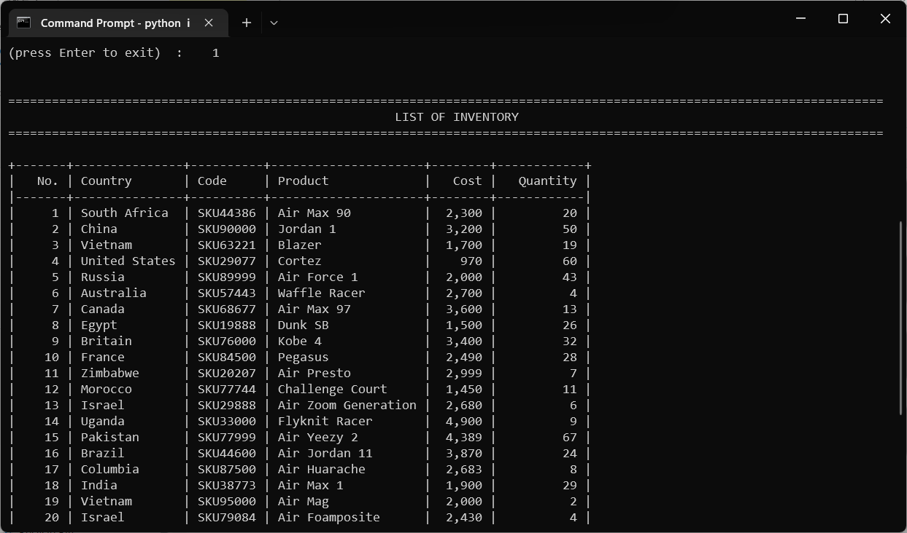
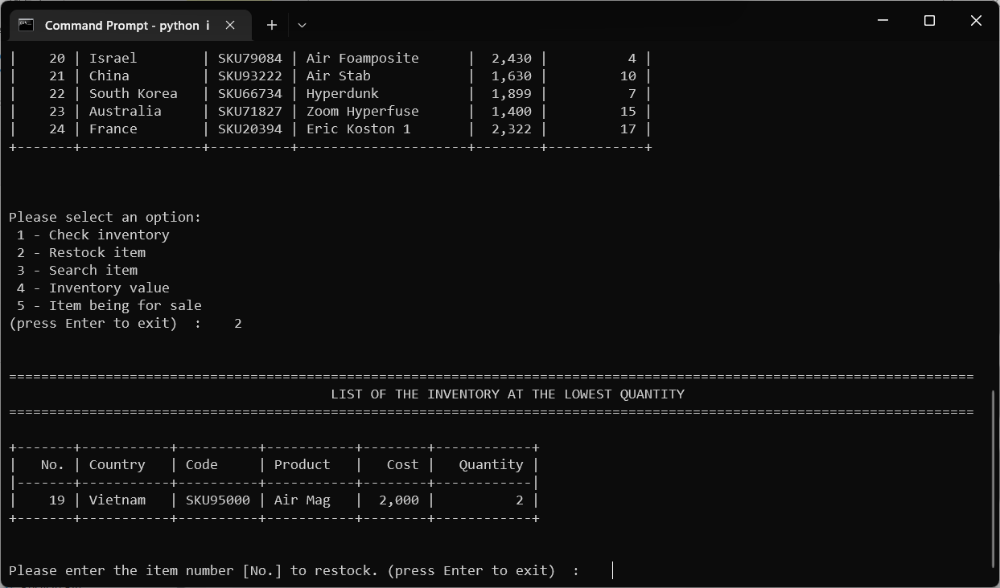
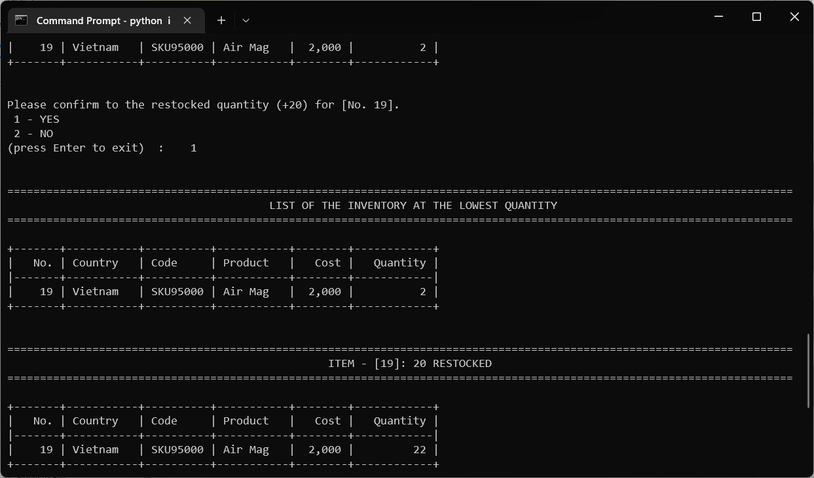
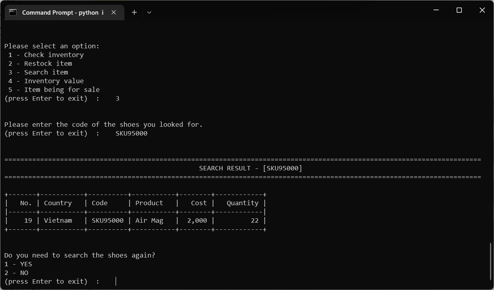
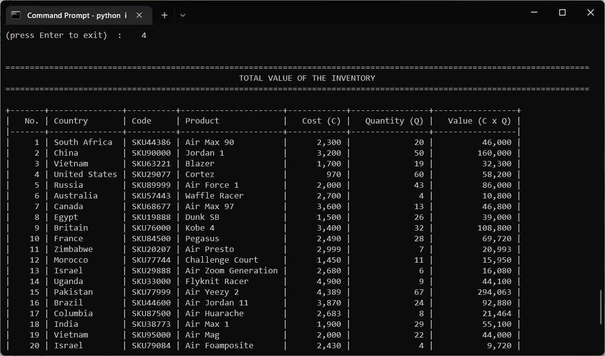
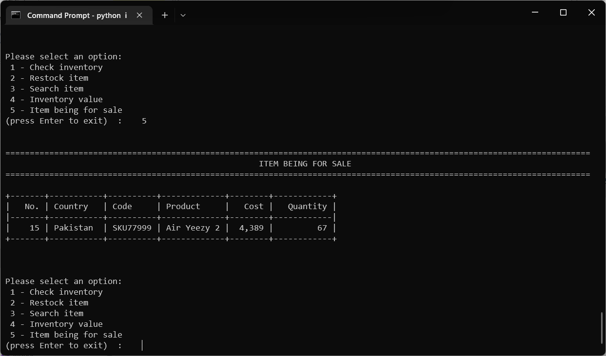

# DfE Software Engineering - Capstone Projects
- Author: <a href="https://www.linkedin.com/in/gabriel-desir/" target="_blank">McZane Gabriel Desir </a>

## Table of Contents
| Name                                                                     | Description  |  Technology  |
|--------------------------------------------------------------------------|---|---|
| [Shoe Store Inventory Manager](#capstone-project-iv-inventory-system) | Built a financial calculator that allows the user to access two different financial calculators: an investment calculator and a home loan repayment calculator.  | Python |


---

## [Capstone Project IV: Inventory System](#dfe-software-engineering---capstone-projects) 

<a href="https://bit.ly/3WB1Uru" target="_blank"> :arrow_right: Preview</a> 

### Introduction
This program is an **inventory management tool** for shoe warehouses. It allows the user to perform various tasks related to **managing the warehouse** and its **inventory**. It will read from the text file **inventory.txt**.

  <p align="center"><br><i>Fig. 4.1 Overview of Inventory Management System</i></p>

### Getting Started
These instructions will get you a copy of the project up and running on your local machine for development and testing purposes.

#### Prerequisites
You will need the following software to run the **inventory management tool**:

- [Python 3](https://www.python.org/)
- [tabulate](https://pypi.org/project/tabulate/) (for formatting table output)

#### Installation
To get started with the inventory system, follow these steps:

1. **Clone** the repository:

```sh
git clone https://github.com/cwchan0212/finalCapstone.git
```

2. **Navigate** to the project directory:

```
cd finalCapstone/capstone_04/
```

3. **Run** the **inventory.py** file:

```sh
python inventory.py

```
4. Install tabulate library:

```sh
pip install tabulate
```

### File Structure
- **inventory.py:** Main program file containing the **Shoes** class and functions to perform various tasks.
- **inventory.txt:** A text file containing the data for the shoe warehouse.

### Class

#### Shoes

- Attributes:
  - **country:** Country of origin for the shoes.
  - **code:** Unique code for the shoes.
  - **product:** Name of the shoe product.
  - **cost:** Cost of the shoes.
  - **quantity:** Quantity of the shoes in stock.

- Methods:
  - **get_cost():** Returns the cost of the shoes.
  - **get_quantity():** Returns the quantity of the shoes.
  - **__ str__():** Returns a string representation of the shoes.

### Functions
  - **capture_shoes():** This function allows a user to **capture data** about a shoe and create a shoe object, which is then added to the list of shoes.

  - **view_all():** This function iterates **over the list of shoes** and prints the details of each shoe. Optionally, the details can be formatted as a table using Python's tabulate module.

  - **re_stock():** This function finds the **shoe with the lowest quantity** and asks the user if they want to **add more** of this type of shoe to the warehouse. If the user confirms, the quantity is updated in the **inventory.txt** file and the list of shoes.

  - **search_shoe():** This function **searches** for a shoe in the list using its **code** and returns the shoe object.

  - **value_per_item():** This function **calculates** the **total value** for each item in the warehouse. The total value is calculated as the product of the **cost and quantity** of the shoes.

  - **highest_qty():** This function determines the shoe with the **highest** quantity and prints it as **being for sale**.
### Usage
To run the program, execute the **inventory.py** file. A menu will be displayed, allowing you to choose which task to perform. Follow the prompts to complete the task.

#### Menu
Once the user accesses the program, the menu is shown below:
- **1** - Check inventory
- **2** - Restock item
- **3** - Search item
- **4** - Inventory value
- **5** - Item being for sale

  <p align="center"><br><i>Fig. 4.2 Menu</i></p>

#### Features

- **Check inventory:** It displays **country**, **product code,** **product name**, **cost** and **quantity** of all the inventory in the warehouse.

  <p align="center"><br><i>Fig. 4.3 Check inventory</i></p>

- **Restock item:** It finds the item with the **lowest** quantity that need to be re-stocked. 

  <p align="center"><br><i>Fig. 4.4 Restock item</i></p>
  
  <p align="center"><br><i>Fig. 4.5 Restock item (+ quantity) </i></p>
 
- **Search item:** It searches for a item by product **code**.

<p align="center"><br><i>Fig. 4.6 Search item by product code</i></p>

-  **Inventory value:** It calculates the total value (**cost x quantity**) for each item.

<p align="center"><br><i>Fig. 4.7 Inventory value</i></p>

- **Item being for sale:** It determines the item with the **highest quantity** as being for sale.

<p align="center"><br><i>Fig. 4.8 Item being for sale</i></p>


---

## Acknowledgments
This projects were inspired by [HyperionDev](https://www.hyperiondev.com/). 
