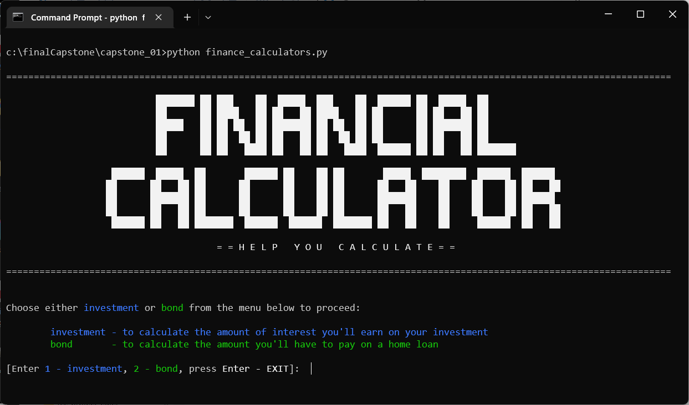
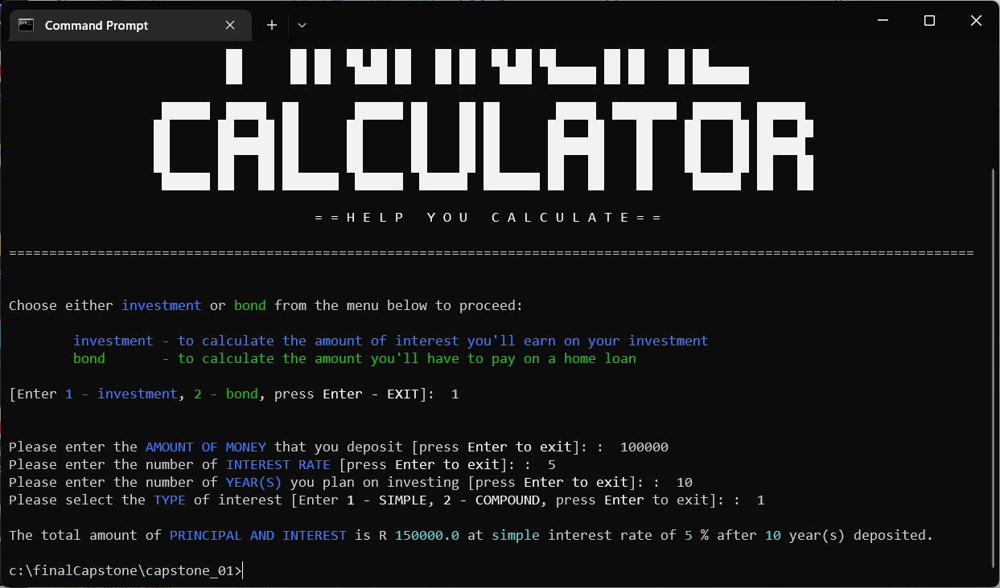

## DfE Software Engineering - Capstone Projects
- Author: <a href="https://www.linkedin.com/in/gabriel-desir/" target="_blank">McZane Gabriel Desir </a>

| Name  | Description  |  Skills  | Completion Date  | Difficulty  | Preview |
|---|---|---|---|:-:|:-:|
| [Financial Calculator](#capstone-project-i-financial-calculator)  | Built a financial calculator that allows the user to access two different financial calculators: an investment calculator and a home loan repayment calculator.  | Python  | 6 December 2022  | :star: :star:  | <a href="https://bit.ly/3vyy77A" target="_blank"> :arrow_right: </a>  |


---

## [Capstone Project I: Financial Calculator](#dfe-software-engineering---capstone-projects)

### Introduction
This project contains a program that allows the user to access two different financial calculators: an **investment calculator** and a **home loan repayment calculator**.

<p align="center"><br><i>Fig. 1.1 Overview of Financial Calculator</i></p>

### Getting Started
These instructions will get you a copy of the project up and running on your local machine for development and testing purposes.

#### Prerequisites
You will need the following software to run the financial calculators:

- [Python](https://www.python.org/)

#### Installation
To get started with the financial calculators, follow these steps:

1. **Clone** the repository:

```sh
git clone https://github.com/cwchan0212/finalCapstone.git
```

2. **Navigate** to the project directory:

```sh
cd finalCapstone/capstone_01/
```

3. **Run** the **finance_calculator.py** file:

```sh
python finance_calculator.py
```

### File Structure
- **finance_calculator.py:** Main program file containing functions to perform various tasks.

### Usage

#### Investment Calculator 

The **investment calculator** allows the user to **calculate the future value of their investment** based on the **amount of deposit** (i.e. the initial principal), **annual interest rate**, the number of **years** and **type of interest** (simple / compound). 

To use the investment calculator, follow the prompts in the command line interface (CLI).

<p align="center"><br><i>Fig. 1.2 Simple Interest Calculation</i>  </p>

<p align="center"><br><i>Fig. 1.3 Compound Interest Calculation</i></p>

##### Formula of Simple Interest

A = P (1 + r x t), where
- A	= final amount (principal + interest)
- P	= initial principal balance
- r	= annual interest rate
- t	= time (in years)

```py
amount = round(deposit_amount *(1 + (interest_rate/100) * year), 2)
```

##### Formula of Compound Interest 
A = P [(1 + r/n)]^(n x t), where
- A	= final amount (principal + interest)
- P	= initial principal balance
- r	= interest rate
- n	= number of times interest is applied per period
- t	= number of periods elapsed

```py
amount = round(deposit_amount * math.pow((1 + (interest_rate/100)), year), 2)
```
#### Home Loan Repayment Calculator

The **home loan repayment calculator** allows the user to calculate the **monthly repayment amount** based on the **loan principal**, **interest rate**, and **loan term** (i.e. months).

To use the home loan repayment calculator, follow the prompts in the CLI.

<p align="center"> <br><i>Fig. 1.4 Monthly Repayment Calculation</i></p>

##### Formula of Monthly Repayment Amount
p = r x PV / (1 - (1 + r)^ - n), where
- p = monthly repayment amount
- PV = present value of the house
- r = rate per period
- n = number of periods

```py
amount = round(((interest_rate/100)/12) * present_value_of_the_house / (1 - math.pow((1 + ((interest_rate/100)/12)), (-number_of_months))), 2)
```

---

## Acknowledgments
This projects were inspired by [HyperionDev](https://www.hyperiondev.com/). 
