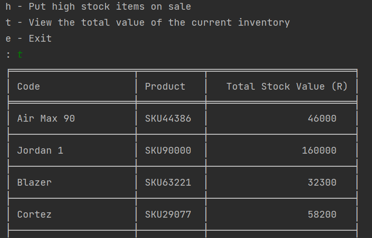

# HyperionDev DfE Software Engineering - Capstone Projects
- Created By: <a href="https://www.linkedin.com/in/gabriel-desir/" target="_blank">McZane Gabriel Desir </a>

## Table of Contents
| Name                                                                   | Description                                                                                                             |  Technology  |
|------------------------------------------------------------------------|-------------------------------------------------------------------------------------------------------------------------|---|
| [Shoe Store Inventory Manager](#capstone-project-iv-inventory-manager) | A shoe store inventory manager that allows the user to add, update and view all of the stock in their store's inventory | Python |


---
## [Capstone Project IV: Inventory Manager](#dfe-software-engineering---capstone-projects) 

### Overview
This script allows a user to manage and administrate their stock. In this particular example a shoe store's inventory is included
in the **inventory.txt** file provided. However, any text file containing CSV formatted data can be read by the manager.
To search by SKU a unique SKU identifier must be included.

  <p align="center"><br><i>Inventory Manager main menu</i></p>

### Files Included
- **inventory.py:** Main program file containing the **Shoes** class and functions to perform various tasks.
- **inventory.txt:** A text file containing the data for the shoe warehouse.

### Getting Started
The following instructions will help you get up and running

#### Prerequisites
You will need the following installed to run the **inventory management tool**
These can either be installed globally or you can create a virtual environment
learn more about virtual environments here

- [How to Set Up a Virtual Environment](https://www.freecodecamp.org/news/how-to-setup-virtual-environments-in-python/)

The following packages/installs are needed:

- [Python 3](https://www.python.org/)
- [Tabulate](https://pypi.org/project/tabulate/) (for formatting table output)
- [Pandas](https://pypi.org/project/pandas/) (used for handling of CSV data)

#### Installation

1. **Clone** the repository:

```sh
git clone https://github.com/DocDooom/final-capstone.git
```

2. Install Tabulate:

```sh
pip install tabulate
```

3. Install Pandas:

```sh
pip install pandas
```
4. In a Terminal or Command Prompt window **Navigate** to the project directory:

```
cd ./capstone_iv/
```

5. **Run** the **inventory.py** file:

```sh
python inventory.py
```

---

### Usage
To run the program, execute the **inventory.py** file. A menu will be displayed, allowing you to choose which task to perform. Follow the prompts to complete the task.

Inventory data should show **Inventory data OK ✓.**
If there is a problem you will see the following screen:

<p align="center"><br><i>Fig. 1.1 Inventory Error</i></p>

If this occurs you should check that your **inventory.txt** file is located in the same folder as your
**inventory.py** file.

Issues with the data within the **inventory.txt** will produce a warning.

<p align="center"><br><i>Fig. 1.2 Inventory Error</i></p>

#### Menu
The program launches with a header and main menu from this menu you can select actions you'd like to take on
the loaded inventory.

- **v** - View all inventory
- **s** - Search for shoe by SKU
- **a** - Add new item to inventory
- **r** - Restock low items
- **h** - Put high stock items on sale
- **t** - View the total value of the current inventory
- **e** - Exit

  <p align="center"><br><i>Fig. 1 Main Menu</i></p>

#### Features

- **View All Inventory:** Displays a table of **country**, **product code,** **product name**, **cost** and **quantity** 
for all the inventory loaded from the **inventory.txt** file

  <p align="center"><br><i>Fig. 1.3  v selected inventory top </i></p>
<p align="center"><br><i>Fig. 1.4 inventory display bottom -> back to main menu </i></p>


- **Search by SKU:** allows you to search for a shoe by SKU. You do not have to input the SKU prefix to find the shoe
The program will automatically detect whether you have included it or not. 

  <p align="center"><br><i>Fig. 1.5 Search by SKU</i></p>
 
- **Add New Item to Inventory:** This allows you create a new entry in the inventory by inputting the various needed parameters

<p align="center"><br><i>Fig. 1.6 Add a new item</i></p>

- **Restock low items:** This gives you the ability to view what item has the lowest stock and decide to restock that item

<p align="center"><br><i>Fig. 1.7 The above gives you the option to change stock levels to a new desired value</i></p>

- **Put High Stock Items On Sale:** This options shows the item with the highest stock amount and lets you input the **percentage (%)** you'd like to discount by

<p align="center"><br><i>Fig. 1.8 Here we are putting the Air Yeezy 2 on sale with a discount of 20%</i></p>

- **View total inventory value:** This lets us know the total value of the stock we currently have for each item so - price x quantity = value.

<p align="center"><br><i>Fig. 1.9 Total stock value top</i></p>
<p align="center"><br><i>Fig. 2.0 Total stock value bottom</i></p>

- **Exit:** terminates the program Note: There is no need to worry about saving changes as changes are saved whenever they are made.


---

## Acknowledgments
This project(s) is my solution for tasks created by [HyperionDev](https://www.hyperiondev.com/). 
